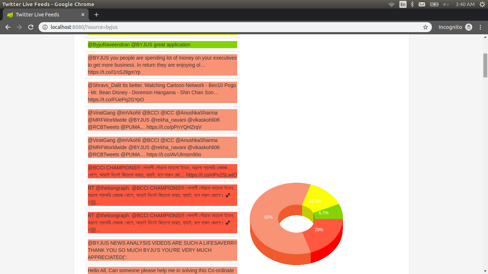

# Requirements
- Java - 1.8.x
- Gradle - 3.5+

# Rest APIS
##Search for a keyword
Aim to search tweet from a given keyword such as hashtag or plain text
```http
GET  /tweets_sentiments/?source=%23IndVsBan
GET  /tweets_sentiments/?source=elections
```
Request params:

| Parameter | Type | Description |
| :--- | :--- | :--- |
| `source` | `string` | **Required**. Your search keyword |

##Search for a specific twitter account
Aim to get tweets for a specific twitter account
```http
GET  /tweets_sentiments/?source=@ayushjain2911
```
Request params:

| Parameter | Type | Description |
| :--- | :--- | :--- |
| `source` | `string` | **Required**. An specific twitter account |
## Response
API endpoints return the JSON response
```javascript
{
  "statusCode" : int,
  "data" : [{
        "userName" : string,
        "userDisplayName" : string,
        "text" : string,
        "sentiment" : string
  }]
}
```

Sample Output:

```javascript
{"statusCode":200,"data":[{"userName":"indresh7prince","userDisplayName":"Indresh Reddy","text":"RT @Wriddhipops: Congratulations Team! It was an amazing experience to play this special Test match & to see the number of ppl who turned u…","sentiment":"WEAK_POSITIVE"},{"userName":"alokrules","userDisplayName":"Alok tiwari","text":"RT @Mittermaniac: Like where does #Manjrekar get all this shitty arrogance from? As a \"player\", which he keeps harping on, he was inconsequ…","sentiment":"WEAK_NEGATIVE"},{"userName":"PremiumCricket1","userDisplayName":"Premium Cricket Predictions","text":"CHAMP12NS\n.\n12 consecutive home Test series wins for #TeamIndia.\nThey're right on top of the #WTC21 table with 360… https://t.co/vTO4b9Ixat","sentiment":"WEAK_POSITIVE"},{"userName":"MonikaJ67120265","userDisplayName":"Monika Jain","text":"RT @CricketNDTV: Rohit Sharma takes an insane slip catch, Twitter bows down to \"superhero\"\n\n#RohitSharma\n#INDvBAN\n#INDvsBAN\n#PinkBallTest\n#…","sentiment":"WEAK_NEGATIVE"},{"userName":"varun18vijay","userDisplayName":"Varun Vijay","text":"RT @htTweets: #IndvsBan | @imVkohli breaks @msdhoni's record as India thrash Bangladesh in day-night Test\n\nRead more here: https://t.co/XwP…","sentiment":"WEAK_NEGATIVE"},{"userName":"Sudhu7777","userDisplayName":"Sudharshan Reddy","text":"RT @RaviShastriOfc: Great pink show in Kolkata. President @SGanguly99 ensured no stone was left unturned. Well done ! #PinkBallTest #India…","sentiment":"WEAK_NEGATIVE"},{"userName":"DBhaskarHindi","userDisplayName":"Dainik Bhaskar Hindi","text":"#विराट_कोहली की कप्तानी में भारत की लगातार 7वीं टेस्ट जीत, धोनी का रिकॉर्ड तोड़ा\nआगे पढ़े.....\n#INDvsBAN #TeamIndia… https://t.co/NYnErvF7To","sentiment":"WEAK_NEGATIVE"},{"userName":"eecraft","userDisplayName":"Jayarama Shenoy","text":"#cricket In perhaps an unintended consequence of the Test Championship, are we seeing a surge of innings wins? Indi… https://t.co/VvhbpacY7Z","sentiment":"WEAK_NEGATIVE"},{"userName":"iam_shiva__","userDisplayName":"Shiva \uD83D\uDD25","text":"RT @vk_fangirl: Happy Captain @imVkohli\n\uD83D\uDE1A❤️\nSwagstar of the match \uD83D\uDD25❤️\n#INDvsBAN #PinkBallTest https://t.co/HlyNzVmdz2","sentiment":"WEAK_NEGATIVE"},{"userName":"viveksekhar1","userDisplayName":"Vivek","text":"RT @Mittermaniac: Like where does #Manjrekar get all this shitty arrogance from? As a \"player\", which he keeps harping on, he was inconsequ…","sentiment":"WEAK_NEGATIVE"},{"userName":"am_vaishali","userDisplayName":"Vaishali","text":"RT @am_vaishali: Here is my perfect screenshot team\n @AawazDotCom \n\n#IndvsBan #PinkBallTest #AawazSunno #TestMatch \nJoin\n@abha_mishra19\n@Ni…","sentiment":"WEAK_NEGATIVE"},{"userName":"am_vaishali","userDisplayName":"Vaishali","text":"Here is my perfect screenshot team\n @AawazDotCom \n\n#IndvsBan #PinkBallTest #AawazSunno #TestMatch \nJoin… https://t.co/erxiEehU6z","sentiment":"NEUTRAL"},{"userName":"Santoshmalhad","userDisplayName":"Santosh Kumar","text":"RT @ZeeNewsHindi: #INDvsBAN: जानिए, कैसे जीता #TeamIndia ने 2 दिन 48 मिनट में अपना पहला #PinkBallTest\n\nhttps://t.co/zP1toeO8T1","sentiment":"WEAK_NEGATIVE"},{"userName":"SWAPNILBANKAR15","userDisplayName":"SWAPNIL D. BANKAR","text":"RT @vchetan21: Pink city change to kolkata for next 5 days as this is 1st day night test match with pink ball...\n@ICC @BCCI  #INDvsBAN http…","sentiment":"WEAK_NEGATIVE"},{"userName":"pranav9983","userDisplayName":"Pranav Patel","text":"RT @CricketNDTV: #SanjayManjrekar's comments on #HarshaBhogle's knowledge of cricket angers fans on Twitter\n\n#INDvBAN #INDvsBAN #DayNightTe…","sentiment":"WEAK_NEGATIVE"}]}
```

## Status Codes

Response returns the following status codes in its API:

| Status Code | Description |
| :--- | :--- |
| 200 | `SUCCESS` |
| 400 | `BAD REQUEST` |
| 404 | `NOT FOUND` |
| 500 | `INTERNAL SERVER ERROR` |

## Sentiments Codes

Sentiments Enum Mapping:

| Status Code | Description | Color |
| :--- | :--- | :--- |
| 0 | `STRONG_NEGATIVE` | tomato |
| 1 | `WEAK_NEGATIVE` | darksalmon |
| 2 | `NEUTRAL` | yellow |
| 3 | `WEAK_POSITIVE` | yellowgreen |
| 4 | `STRONG_POSITIVE` | darkseagreen |

# Live Stream Dashboard
## Dashboard
```http
  URL/?source=%23IndVsBan
```
| Parameter | Type | Description |
| :--- | :--- | :--- |
| `source` | `string` | **Required**. Your search keyword |

## WebSockets in a Spring Boot Application

- `/app/live` - Message Mapping URL
- `/topic/source.{query}` - Message Broker topic for pushing messages to the UI back.

## UI
Word Cloud

Donut 3D


## WebSockets Payload
WebSockets pushes the JSON response contains new tweets
```javascript
[
    {
        "userName" : string,
        "userDisplayName" : string,
        "text" : string,
        "sentiment" : string
    }
]
```
## WebSockets Events
  - annotate `@EventListener` to determine 'onSessionConnected' and 'onDisconnectEvent' and track sessions.
```java
@Configuration
@EnableWebSocketMessageBroker
public class WebSocketConfig {

    @EventListener
    public void onSessionConnected(SessionConnectEvent event) {
    }

    @EventListener
    public void onDisconnectEvent(SessionDisconnectEvent event) {
    }
}
```

### @EventListener Function
###### onSessionConnected
> Track sessionId from `StompHeaderAccessor` class.
> Store sessionId in the `SessionManager`.
###### onDisconnectEvent
> Remove sessionId in the `SessionManager`.
> Terminate thread for the sessionId.


## Unit Testing
- `ApplicationTest` @SpringBootTest annotation tells Spring Boot to go and look for a main configuration class (one with @SpringBootApplication for instance), and use that to start a Spring application context.
- `TweetsServiceImplTest`
###### function checkIfTweetsAreOfSameUser
> Validate each tweet by a particular user.
###### function checkIfTweetsAreFromDifferentUsers
> Validate non null response for data payload in `BaseResponse`
###### function testCoreSentiment
> Validate output sentiment against test sets

## SessionManager
HashMap where `SessionId` is key `MaxSinceId` as value. Ideally this service works as standalone entity in distributed system.
Each user query will have different `SessionId`.

### Todo
- Integrate Sliding window to make sure the `getRateLimitStatus()` doesn't overflow.
- Enhance thread logic in web socket live feed controller.
- Add controller test cases.

## Twitter Java Api Examples
- (http://twitter4j.org/en/code-examples.html "Twitter Java Api Examples")

## Stanford Core NLP
- (https://nlp.stanford.edu/sentiment/ "Sentiment Analysis")
